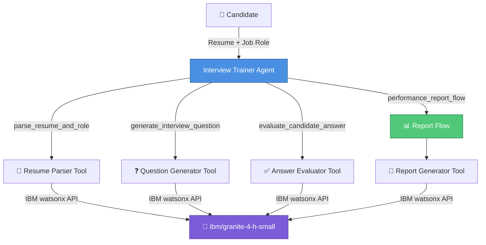
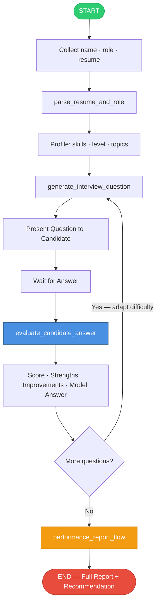

# Interview Trainer Agent

An AI-powered adaptive mock interview coach built on **IBM watsonx Orchestrate** using the `ibm/granite-4-h-small` model.

## Architecture



## Interview Workflow



## Project Structure

```
interview_trainer/
├── __init__.py
├── main_flow.py               # Programmatic test runner
├── import-all.sh              # CLI import script
├── README.md
├── tools/
│   ├── __init__.py
│   ├── interview_tools.py     # Python tools: parse, generate, evaluate, report
│   ├── interview_flow.py      # Flow: resume parse → question → evaluation
│   └── report_flow.py        # Flow: compile Q&A → performance report
├── agents/
│   └── interview_trainer_agent.yaml
├── backend/
│   └── app.py                 # Flask REST API for the web UI
├── frontend/
│   └── index.html             # Standalone web UI
└── generated/                 # Compiled flow specs
```

## Features

- **Adaptive difficulty** — increases to Hard after 2 consecutive 8+/10 scores; drops to Easy after 2 consecutive <4/10 scores
- **Resume-aware questions** — topics and depth tailored to the candidate's actual skills
- **Real-time feedback** — per-question score, strengths, improvements, model answer, and follow-up
- **Performance report** — Markdown report with executive summary, skill table, and Hire/Consider/Not Ready recommendation
- **Full web UI** — dark-themed chat interface with sidebar controls and live stats

## Prerequisites

```bash
pip install ibm-watsonx-orchestrate flask flask-cors requests pydantic
```

## Import into watsonx Orchestrate

```bash
chmod +x interview_trainer/import-all.sh
./interview_trainer/import-all.sh
```

Then start the chat:
```bash
orchestrate chat start
# Select: interview_trainer_agent
```

## Run the Web UI

### 1. Start the backend
```bash
pip install flask flask-cors requests
python interview_trainer/backend/app.py
# → http://localhost:5000
```

### 2. Open the frontend
```bash
# Simply open in your browser:
open interview_trainer/frontend/index.html
# Or serve it:
python -m http.server 8080 --directory interview_trainer/frontend
```

### 3. Use the app
1. Fill in your name and target job role
2. Paste your resume text in the sidebar
3. Click **▶ Start Interview Session**
4. Answer each question; get real-time feedback
5. Click **📊 Generate Report** for the final performance report

## Programmatic Testing

```bash
export PYTHONPATH=/path/to/adk/src:/path/to/adk:.
python3 interview_trainer/main_flow.py
```

## API Endpoints (Backend)

| Method | Endpoint | Description |
|--------|----------|-------------|
| GET | `/api/health` | Health check |
| POST | `/api/parse_resume` | Parse resume + job role |
| POST | `/api/generate_question` | Generate next question |
| POST | `/api/evaluate_answer` | Evaluate candidate answer |
| POST | `/api/generate_report` | Generate performance report |

## Configuration

All IBM watsonx credentials are pre-configured in `tools/interview_tools.py` and `backend/app.py`:

| Setting | Value |
|---------|-------|
| Model | `ibm/granite-4-h-small` |
| API URL | `https://us-south.ml.cloud.ibm.com/ml/v1/text/generation?version=2023-05-29` |
| Project ID | `66d8b6f7-7a05-43a6-aec9-6c328b542c18` |
